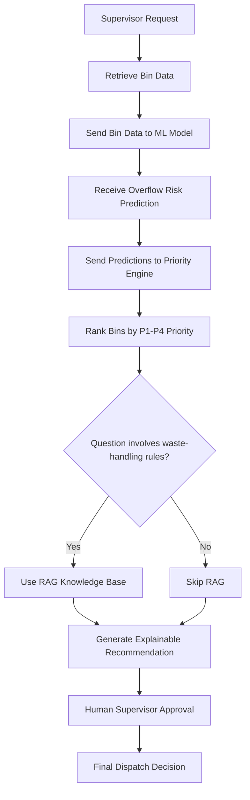

# Phase 6: Agentic Decision-Support Workflow

This project adds a lightweight agentic workflow that coordinates three existing project components:

1. The ML prediction system for overflow-risk classification
2. The collection-priority engine for ranking bins by service urgency
3. The local RAG knowledge base for waste-handling guidance

## Objective

The agent acts as a transparent coordinator. It does not replace the ML model, priority engine, or human operator.

## Workflow

1. Receive a supervisor or user question.
2. Retrieve the latest bin dataset.
3. Send selected features to the ML model.
4. Convert predictions into risk labels.
5. Pass the predictions to the priority engine.
6. Rank bins using a transparent prototype scoring rule.
7. If the user asks a waste-handling question, retrieve the relevant knowledge-base answer.
8. Produce a human-readable recommendation with three clear sections:
   - Prediction
   - Evidence
   - Recommendation
9. Keep the human operator responsible for final dispatch decisions.

## Important Limitation

The workflow must not claim that the agent controls vehicles, makes final collection decisions, or replaces the supervisor.

## Files

- `src/agent_workflow.py`: Coordinator workflow and explanation structure.
- `src/agent_demo.py`: Example question set and demonstration output.

## Workflow Flow Diagram

## Example Questions

- Which bins should we collect now?
- Why is Bin B27 high priority?
- Which area needs attention first?
- What should we do with the e-waste collected from Block A?
- Which bins are likely to overflow within the next few hours?
